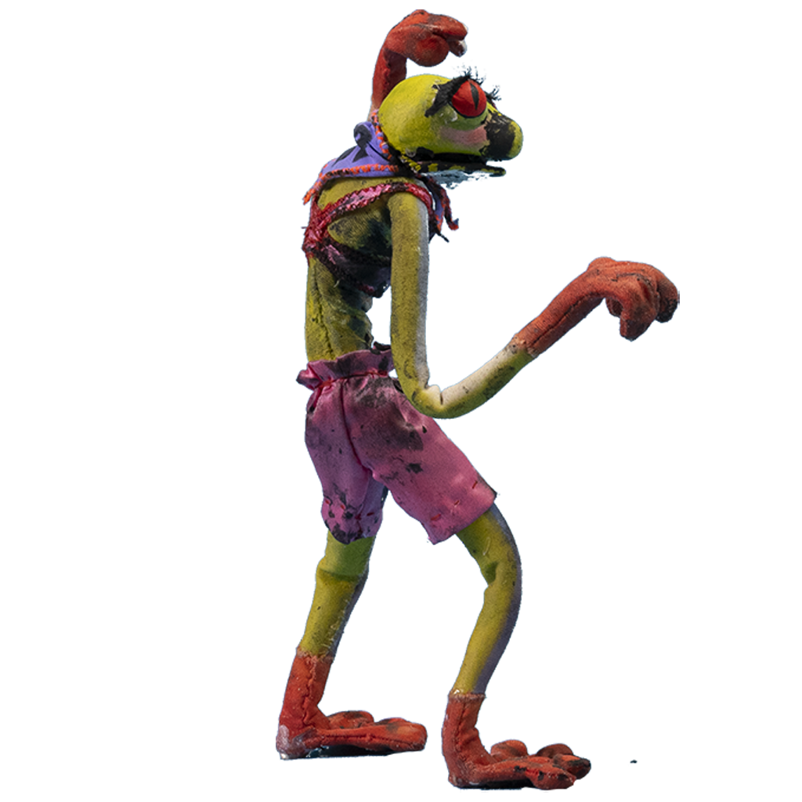

<!-- #region -->
# Intro
I am working on a game with a friend from UMPRUM, which will be used by people learning **animation** on UMPRUM. It is a fighting game called **[Fajtov](https://lukasmasak.itch.io/fajtov)**, where the user can upload their own characters with animations and play as them. Part of the whole system is a **GPU compute shader pipeline**, where the user can customise and generate **Normal maps** for all frames of their animation. Normal maps are used to add extra details without changing the geometry ([interactive demo](https://cpetry.github.io/NormalMap-Online)).


The first image is **the source image**, the second one is **the generated normal map** using the pipeline, and the third one is a lit up **source image with the normal map applied**.
  

(The effect might not be very noticeable on a still image. For a better look, I recommend trying the interactive demo above or watching a video about normal maps.)

<!-- #endregion -->

## Problem definition
Currently, generating just one normal map for a `2048x2048` image can take anywhere from **3-66 seconds** (depending on set parameters), which is not ideal. My goal with this performance evaluation experiment will be to:
- Measure each stage of the normal map pipeline
- Analyse the weak points
- Try to create an optimised version
- Measure the optimised version and compare it to the first one

I expect the main pitfall to be in the calculation of the distance map, as it uses a brute-force approach algorithm.


## GPU Pipeline definition

The pipeline has 4 stages. Each stage starts with the CPU dispatching a compute shader and waiting for the results. The stages are:
1. Applying Gaussian Blur to the input image
2. Calculating the distance map from the input image
3. Generating the normal map
4. Applying Gaussian Blur to the final normal map

Here is an image with intermediate results to get a better idea:


# Testing Specification
The game is made in a game engine called **Unity**. The CPU-side code is written in **C#**, since it is the only one the engine supports. The GPU-side code is written in **HLSL**, which is the language compute shaders use (similar to C).

## PC Specifications
All testing was done on these PC specs:
- OS - Windows 10
- CPU - INTEL i5-8400 2.80GHz
- RAM - 16GB
- GPU - NVIDIA RTX 3060 12 GB
- DISK - Kingston KC3000 2TB M.2 SSD

## Normal Map Generator Parameters
The normal map generator has 6 different parameters. While I was trying out different combinations of them, the biggest impact on measured time had the `Border Distance` parameter. This parameter controls how far each pixel looks, to find the border (closest pixel with `alpha=1`), during the **Distance Map** generation (Stage 2).

That's why I decided that I would measure generation time for several values of this parameter.

## Testing Data
I will be testing the generator on one `2048x2048` texture and one `1024x1024` texture. These textures belong to characters from the game, that way the testing will be done on real enough data.

 

## Testing Parameters
Both of the parameters mentioned below had been lowered a lot due to the unoptimized version taking around 66 seconds per generation on the most performance-heavy settings. 

### Border Distance
As mentioned above, I chose the `Border Distance` parameter and tested several variants. The parameter is measured in units corresponding to the percentage of the texture dimensions, which allows it to scale appropriately with bigger images. The parameter itself has a range of `[0, 0.5]` since bigger values take too long to measure, with little to no use case. To get enough sample points, I decided to measure the full range from `0` to `0.5` with a step size of `0.05` -> 11 parameter variants.

### Repeats
I chose to do only 15 repeats per `Border Distance` value. This is a tradeoff between stable enough results and the time it takes to test it.

```{python}


```

```{python}

```

```{python}

```

# Old Version Testing

## Per Stage
Since the stages are dependent on each other, I took several measurements after each stage for a fixed `Border Distance = 0.3`. This will help me analyse where the weak point of the pipeline is.

```{python}
library(tidyverse)

# Read both data files
x1 <- read_csv('data/old_2048_stages.txt', col_types = 'cnii') %>% mutate(dataset = "2048x2048 px")
x2 <- read_csv('data/old_1024_stages.txt', col_types = 'cnii') %>% mutate(dataset = "1024x1024 px")

# Combine into one data frame
combined_data <- bind_rows(x1, x2)

# Plot
ggplot(combined_data, aes(x = as.numeric(stage), y = time, color = dataset)) + 
  stat_summary(fun = mean, geom = "line", linewidth = 2) +
  scale_y_continuous(n.breaks = 20) +
  labs(title = "Time after each stage", x = "Stages", y = "time [ms]", color = "Texture") +
  theme(
    axis.title = element_text(size = 20), 
    plot.title = element_text(size = 20, face = "bold", hjust = 0.5), 
    axis.text = element_text(size = 12),
    legend.title = element_text(size = 14),
    legend.text = element_text(size = 12)
  )
```

Looking at the graph, we can see a big spike in measured time from the first to the second stage in the case of the `2048x2048` texture. This confirms my suspicions that the second stage (**distance map** calculation) is the most performance-heavy. Moreover, we can see that when we test using a `1024x1024 px` texture instead of the `2048x2048 px` texture, the time difference is not as drastic, suggesting a polynomial complexity or worse with respect to the input texture.


## Full Pipeline
Since the stage testing showed the second stage was the problem, I tested the old version on the full range of the `Border Distance` parameter, which altogether took more than an hour.

```{python}
# Read both data files
x1 <- read_csv('data/old_2048.txt', col_types = 'cnii') %>% mutate(dataset = "2048x2048 px")
x2 <- read_csv('data/old_1024.txt', col_types = 'cnii') %>% mutate(dataset = "1024x1024 px")

# Combine into one data frame
combined_data <- bind_rows(x1, x2)

# Plot
ggplot(combined_data, aes(x = as.numeric(dist), y = time, color = dataset)) + 
  stat_summary(fun = mean, geom = "line", linewidth = 2) +
  scale_y_continuous(n.breaks = 20) +
  labs(title = "Time to Generate a Normal Map", x = "Border Distance", y = "time [ms]", color = "Dataset") +
  theme(
    axis.title = element_text(size = 20), 
    plot.title = element_text(size = 20, face = "bold", hjust = 0.5), 
    axis.text = element_text(size = 12),
    legend.title = element_text(size = 14),
    legend.text = element_text(size = 12)
  )
```

This graph shows the full time it took to generate the normal maps for the full range of `Border Distance`. The shape of the curve seems to confirm my hypothesis that the algorithm is polynomial with respect to the input texture.

<!-- #region -->
# Code Improvements
I improved many aspects of the code base, from small tweaks and algorithm changes to structure changes of the pipeline.

## Overall Changes
#### Stage 1 and 2 combined
Since the first stage (source blur) and the second one (Distance Map) are not dependent on each other, we can combine these stages into a single one. This saves time because we skip one shader dispatch and one synchronisation of the GPU, which happens at the end of a shader dispatch.

#### Texture copying 
The old version copied the textures from the GPU back to the CPU after each stage and then copied the textures back to the GPU at the next stage. I changed this so that the textures are kept on the GPU between stages and only the final texture is copied back to the CPU.

#### Group size of shader threads
In each compute shader kernel, you can choose the group size of the thread groups the GPU will run. The old version had `[numthreads(32, 32, 1)]`, but through experimentation, I found that `[numthreads(16, 16, 1)]` has better results, so I used it in the new optimised version. This configuration works better, most likely due to the early exits I added in the optimised version (see changes in individual shaders below).

#### Early Exits
The resulting normal map effect is only applied to the source texture with visible pixels. With that in mind, we can skip all pixels that are not visible. This saves us quite a lot of performance, since all stages can benefit from this, and the textures feature a lot of empty space (`2048x2048 px` texture has ~69% of empty pixels).
```c
// Check if the pixel is even visible
if (srcTex[coords].a <= 0.1)
{
	destTex[coords] = float4(0, 0, 0, 0);
	return;
}
```

## Gaussian Blur Shader
The Gaussian Blur shader works like this:
- The Gaussian Kernel is generated on the CPU and sent to the GPU.
- The resulting pixel is calculated as weighted samples of neighbours multiplied by the Gaussian kernel.

The Gaussian Blur shader was not changed as much, since it was performant enough already (a few ms at most).

#### Bounds precalculation
The old version checks if the current coordinates are in bounds of the texture during every iteration of the double for loop. This is very ineffective, especially on the GPU, where branching is a significant performance hit. So I changed it to precalculate the loop bounds, which helped.

From this:
```c
for y {for x {
    ...
    if (texCoord.x < 0 || texCoord.x >= texSize.x ||
    	texCoord.y < 0 || texCoord.y >= texSize.y)
    {
    	continue;  
    }
}}
```
to this:
```c
int yMin = max(0, coords.y - blurRadius);
int yMax = min(texSize.y - 1, coords.y + blurRadius);
int xMin = max(0, coords.x - blurRadius);
int xMax = min(texSize.x - 1, coords.x + blurRadius);
for y {for x {
    ...
}}
```

## Distance Shader
The distance shader works like this:
- The distance from the current pixel to all neighbours in a radius (`Border Distance`) is calculated
- The smallest one is taken, and a gradient from white to black is drawn on the texture

#### Bounds precalculation
I used the same bounds precalculation as in the Gaussian Blur shader. However, here it had a much bigger impact, since the double loop is run many more times.
```c
int minX = max(0, coords.x - pixelDistance);
int maxX = min(texSize.x, coords.x + pixelDistance);
int minY = max(0, coords.y - pixelDistance);
int maxY = min(texSize.y, coords.y + pixelDistance);
for y {for x {
    ...
}}
```

#### Column major order
Surprisingly, changing the order of the double for loop from:
```c
for (int yRect = minY; yRect <= maxY; yRect++)
{
    for (int xRect = minX; xRect <= maxX; xRect++)
    {
    ...
    }
}
```
to this:
```c
for (int xRect = minX; xRect <= maxX; xRect++)
{
    for (int yRect = minY; yRect <= maxY; yRect++)
    {
    ...
    }
}
```
proved to be more performant, even though my intuition tells me that the first approach would be more cache-friendly. I honestly do not know why that is, but I think it might be dependent on texture size, thread group size, specific GPU parameters, etc.


#### Early double loop exit
The next optimisation makes sense on paper, but the implementation details are surprising. The distance shader loops through a neighbouring area of the source pixel. The base idea is to stop searching when we find an empty pixel right next to the source pixel. One would add this condition to the innermost loop when a new minimal distance is found. However, this adds an immense amount of branching to the code and extremely slows down the performance. Adding the condition after the inner loop is the sweetspot between extra branching and early exits.
```c
for (int yRect = minY; yRect <= maxY; yRect++)
{
    for (int xRect = minX; xRect <= maxX; xRect++)
    {
    ...
    }

    // sqrt(2) is the smallest distance to a neighbour
    if (minDistance < 1.5)
	{
		break;
	}
}	
```

#### Adaptive sampling stepsize
This optimisation is a bit of a cheat. I noticed that there is little to no difference when I increase the increments in the double for loop for larger textures. Through trial and error, I found that if the increment is increased by one each `1024 px`, the texture remains visually the same, while the computational load is four times smaller. 
```c
int stepSize = clamp(round(texSize.x / 1024.0), 1, 10);
...
for (int xRect = minX; xRect <= maxX; xRect+=stepSize)
...
```

#### `min()` instead of a branch
The old version checks if the current distance is the lowest yet found. This is done in the innermost loop of the double for loop. In my attempt to reduce the branching of the code, I replaced this branch: 
```c
if (distance < minDistance)
{
	minDistance = distance;
}
```
by a simple call to a `min()` function:
```c
minDistance = min(minDistance, dist);
```

The `min()` function is very efficiently implemented and does not use branching or other computationally taxing methods.

### Correct use of float and int
The last optimisation I found was the correct use of integers and floats. I somehow managed to mix up the variable types in the old version in such a way that the shader ran twice as slow. My theory is that I somehow forced the shader to convert `float -> int` and vice versa in every iteration of the double for loop.

## Normal Map Shader
The final shader I optimised was the one responsible for the normal map. The shader is quite complex, and a deep knowledge of the inner workings is not needed for this experiment write-up. The only change here was the use of the early exit mentioned in the **Overall Changes** section.


## Note
The early exits create a computation amount discrepancy between the `2048x2048 px` and `1024x1024 px` texture due to the smaller texture having more transparent pixels (~69% vs ~82%). Therefore, these early exit optimisations are not a general optimisation, but due to the nature of the textures (sprite frames for characters), they help a lot. 
<!-- #endregion -->

# Optimised Version Testing and Comparison
Now with the optimisations listed, we can have a look at how the time measurement went.


# Per Stage
Now that the first and second stages run in parallel, I managed to implement it in such a way that the time after each stage can still be measured. However, this omits the performance gained from the parallelisation of the first two stages. The measurements were again taken after each stage for a fixed `Border Distance = 0.3`.

```{python}
# Read both data files
x1 <- read_csv('data/opt_2048_stages.txt', col_types = 'cnii') %>% mutate(dataset = "New: 2048x2048 px")
x2 <- read_csv('data/opt_1024_stages.txt', col_types = 'cnii') %>% mutate(dataset = "New: 1024x1024 px")

# Combine into one data frame
combined_data <- bind_rows(x1, x2)

# Plot
ggplot(combined_data, aes(x = as.numeric(stage), y = time, color = dataset)) + 
  stat_summary(fun = mean, geom = "line", linewidth = 2) +
  scale_y_continuous(n.breaks = 21) +
  labs(title = "NEW: Time after each stage", x = "Stages", y = "time [ms]", color = "Texture") +
  theme(
    axis.title = element_text(size = 20), 
    plot.title = element_text(size = 20, face = "bold", hjust = 0.5), 
    axis.text = element_text(size = 12),
    legend.title = element_text(size = 14),
    legend.text = element_text(size = 12)
  )

# Read both data files
x3 <- read_csv('data/old_2048_stages.txt', col_types = 'cnii') %>% mutate(dataset = "Old: 2048x2048 px")
x4 <- read_csv('data/old_1024_stages.txt', col_types = 'cnii') %>% mutate(dataset = "Old: 1024x1024 px")

# Combine into one data frame
combined_data <- bind_rows(x3, x4)

# Plot
ggplot(combined_data, aes(x = as.numeric(stage), y = time, color = dataset)) + 
  stat_summary(fun = mean, geom = "line", linewidth = 2) +
  scale_y_continuous(n.breaks = 20) +
  labs(title = "OLD: Time after each stage", x = "Stages", y = "time [ms]", color = "Texture") +
  theme(
    axis.title = element_text(size = 20), 
    plot.title = element_text(size = 20, face = "bold", hjust = 0.5), 
    axis.text = element_text(size = 12),
    legend.title = element_text(size = 14),
    legend.text = element_text(size = 12)
  )

# Combine into one data frame
combined_data <- bind_rows(x1, x2, x3, x4)

# Plot
ggplot(combined_data, aes(x = as.numeric(stage), y = time, color = dataset)) + 
  stat_summary(fun = mean, geom = "line", linewidth = 2) +
  scale_y_continuous(n.breaks = 20) +
  scale_color_manual(
        values = c(
          "New: 2048x2048 px" = "#00EE00",
          "New: 1024x1024 px" = "#00AA00",
          "Old: 2048x2048 px" = "#EE0000",
          "Old: 1024x1024 px" = "#AA0000"
        )
      ) +
  labs(title = "COMPARE: Time after each stage", x = "Stages", y = "time [ms]", color = "Version: Texture") +
  theme(
    axis.title = element_text(size = 20), 
    plot.title = element_text(size = 20, face = "bold", hjust = 0.5), 
    axis.text = element_text(size = 12),
    legend.title = element_text(size = 14),
    legend.text = element_text(size = 12)
  )
```

We can see that the second stage is still the main problem even in the new of the pipeline. 
-shape same but lines closer together -> not as huge hit of the second stage
-comparison cool

```{python}
## Full Pipeline
3ššSince the stage testing showed the second stage was the problem, I tested the old version on the full range of the `Border Distance` parameter, which altogether took more than an hour.
```

```{python}
# Read both data files
x1 <- read_csv('data/opt_2048.txt', col_types = 'cnii') %>% mutate(dataset = "2048x2048 px")
x2 <- read_csv('data/opt_1024.txt', col_types = 'cnii') %>% mutate(dataset = "1024x1024 px")

# Combine into one data frame
combined_data <- bind_rows(x1, x2)

# Plot
ggplot(combined_data, aes(x = as.numeric(dist), y = time, color = dataset)) + 
  stat_summary(fun = mean, geom = "line", linewidth = 2) +
  scale_y_continuous(n.breaks = 20) +
  labs(title = "Time after each stage", x = "Stages", y = "time [ms]", color = "Dataset") +
  theme(
    axis.title = element_text(size = 20), 
    plot.title = element_text(size = 20, face = "bold", hjust = 0.5), 
    axis.text = element_text(size = 12),
    legend.title = element_text(size = 14),
    legend.text = element_text(size = 12)
  )
```

# Overall
From the analysis of the graph above we can see a big improvement in the real-time usability of the norma


# Other Ideas for Distance Map Calculation
- downscale texture for the preview
- JPA or the gpt shit
- Preprocess all edges then loop only on the edges (could help in bigger textures)
- Multipass expansion of edges


# AI Disclaimer
In this performance evaluation experiment, I used AI for:
- Normal map code debugging and iterating on optimisation ideas
- Tweaking the R code for graphs
- Grammarly (not sure if it uses AI)

```{python}

```

```{python}

```
