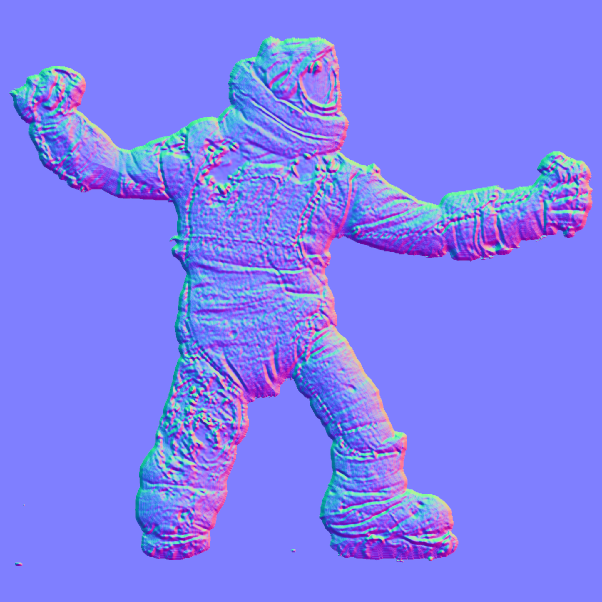
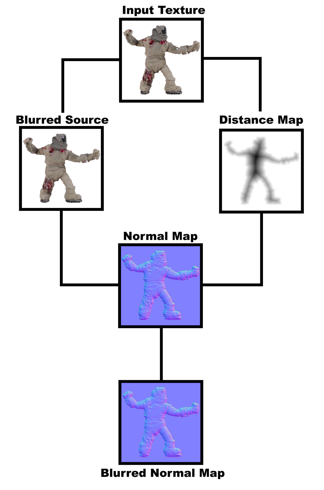

<!-- #region -->
# Intro
I am working on a game with a friend from UMPRUM, that will be used by people learning **animation** on UMPRUM. It is a fighting game called **[Fajtov](https://lukasmasak.itch.io/fajtov)**, where the user can upload their own characters with animations and play as them. Part of the whole system is a **GPU compute shader pipeline**, where the user can customize and generate **Normal maps** for all frames of their animation. Normal maps are used to add extra details without changing the geometry ([interactive demo](https://cpetry.github.io/NormalMap-Online)).


Here are 3 images. The first one is **the source image**, the second one is **the generated normal map** using the pipeline, and the third one is a lit up **source image with the normal map applied**.
  


<!-- #endregion -->

## Problem definition
Currently, generating just one normal map for an `2048x2048` image can take anywhere from **3-45 seconds** (depending on set parameters), which is not ideal. My goal with this performance evaluation experiment will be to:
- Measure each stage of the normal map pipeline
- Analyze the weakpoints
- Try to create an optimized version
- Measure the optimized version and compare it to the first one

I expect the main pitfall will be in the calculation of the distance map since it uses a brute-force approach algorithm.


## GPU Pipeline definition

The pipeline has 4 stages. Each stage starts with the CPU dispatching a compute shader and waiting for the results. The stages are:
- Blurring the input image
- Calculating the distance map from the input image
- Generating the normal map
- Blurring the final normal map

Here is an image with intermediate results to get a better idea:




## Technicalities
The game is made in a game engine called **Unity**. The CPU-side code is written in **C#**, since it is the only one the engine supports. The GPU-side code is written in **HLSL**, which is the language compute shaders use (similar to C).

### Specs
All testing was done on these PC specs:
- CPU - INTEL i5-8400 2.80GHz
- RAM - 16GB
- GPU - NVIDIA RTX 3060 12gb
- DISK - Kingston KC3000 2TB M.2 SSD

```{python}

```

```{python}

```

```{python}

```

# Old Version Testing


# Code Improvements


# New Version Testing


# Comparison


# Other Possible Improvements


# AI Disclaimer
In this performance evaluation experiment I only used AI for quick debugging and iterating on optimization ideas during the development.

```{python}

```
