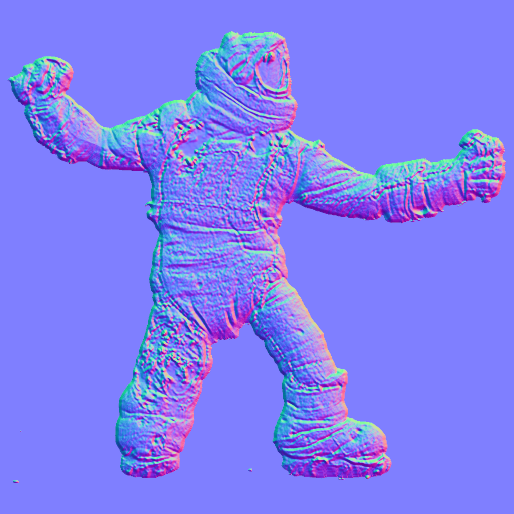
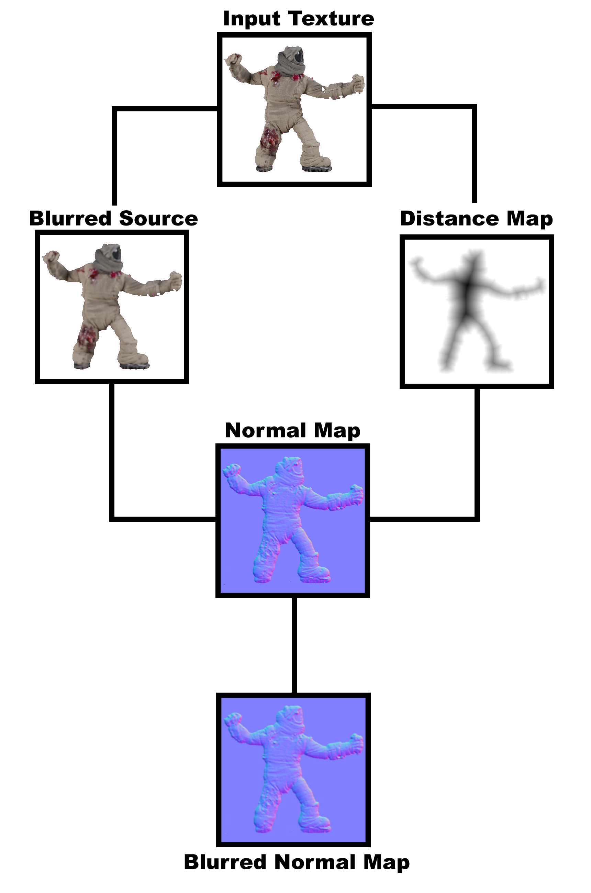

<!-- #region -->
# Intro
I am working on a game with a friend from UMPRUM, which will be used by students who learn animation at UMPRUM. It is a fighting game called **[Fajtov](https://lukasmasak.itch.io/fajtov)**, where the user can play as their own character by uploading their animations and sprites. Part of the whole system is a **GPU compute shader pipeline**, where the user can customise and generate **Normal maps** for all frames of their animations. Normal maps are used to add extra details without changing the geometry ([interactive demo](https://cpetry.github.io/NormalMap-Online)).


The first image is **the source image**, the second one is **the generated normal map** using the pipeline, and the third one is a lit up **source image with the normal map applied**.

  

(The effect might not be very noticeable on a still image. For a better look, I recommend trying the interactive demo above or watching a video about normal maps.)

<!-- #endregion -->

## Problem definition
Currently, generating just one normal map for a `2048x2048` texture can take anywhere from **3-66 seconds** (depending on set parameters), which is not ideal. My goal with this performance evaluation experiment will be to:

- Measure each stage of the pipeline and the full pipeline
- Analyse the weak points
- Try to create an optimised version
- Measure the optimised version and compare it to the old one

I expect the main pitfall to be in the calculation of the distance map, as it uses a brute-force approach algorithm.


## GPU Pipeline definition

The pipeline has 4 stages. Each stage starts with the CPU copying data to the GPU, dispatching a compute shader, waiting for the results, and then the next stage is started. The stages are:

1. Applying Gaussian Blur to the input image
2. Calculating the distance map from the input image
3. Generating the normal map from the distance map and blurred input image
4. Applying Gaussian Blur to the final normal map

Here is an image of the pipeline with intermediate results to get a better idea:




# Testing Specification
The game is made in a game engine called **Unity**. The CPU-side code is written in **C#**, since it is the only one the engine supports. The GPU-side code is written in **HLSL**, which is the language compute shaders use (similar to C).

## PC Specifications
All testing was done on this PC:

- OS - Windows 10
- CPU - INTEL i5-8400 2.80GHz
- RAM - 16GB
- GPU - NVIDIA RTX 3060 12 GB
- DISK - Kingston KC3000 2TB M.2 SSD

## Normal Map Generator Parameters
The normal map generator has 6 different parameters. While I was trying out different combinations of them, the biggest impact on measured time had the `Border Distance` parameter. This parameter controls how far each pixel looks, to find the border (closest pixel with `alpha=0`), during the **Distance Map** generation (Stage 2).

That's why I decided that I would measure generation time for a range of values of this parameter.

## Testing Data
I will be testing the generator on one `2048x2048` texture and one `1024x1024` texture. These textures belong to characters from the game, that way the testing will be done on real enough data.

 

## Testing Parameters
I had to lower the `Border Distance` parameter and the number of repetitions due to the unoptimized version taking around 66 seconds per generation on the most performance-heavy settings. 

### Border Distance
As mentioned above, I chose the `Border Distance` parameter and tested several variants. The parameter is measured in units corresponding to the percentage of the texture dimensions, which allows it to scale appropriately with bigger images. The parameter itself has a range of `[0, 0.5]` since bigger values take too long to measure, with little to no use case. To get enough sample points, I decided to measure the full range from `0` to `0.5` with a step size of `0.05` -> 11 parameter variants.

### Repeats
I chose to do only 15 repeats per `Border Distance` value, since only testing the old version takes more than an hour. This is a good-enough tradeoff between stable enough results and the time it takes to test it.


# Old Version Testing

## Per Stage
Since the stages are dependent on each other, I took measurements after each stage had finished running. This means that all previous stages in the pipeline were also run. The measured times are:

1. After stage 1
2. After stages 1 and 2
3. After stages 1, 2, and 3
4. After stages 1, 2, 3, and 4

I used a fixed value for `Border Distance = 0.3` to not overcomplicate the measurements. Looking at times after each stage will help me analyse where the weak point of the pipeline is.

```{r}
library(tidyverse)

# Read both data files
x1 <- read_csv('data/old_2048_stages.txt', col_types = 'cnii') %>% mutate(dataset = "2048x2048 px")
x2 <- read_csv('data/old_1024_stages.txt', col_types = 'cnii') %>% mutate(dataset = "1024x1024 px")

# Combine into one data frame
combined_data <- bind_rows(x1, x2)

# Per stage plot
ggplot(combined_data, aes(x = as.numeric(stage), y = time, color = dataset)) + 
  stat_summary(fun = mean, geom = "line", linewidth = 2) +
  scale_y_continuous(n.breaks = 20) +
  labs(title = "Time after each stage", x = "Stages", y = "time [ms]", color = "Texture") +
  theme(
    axis.title = element_text(size = 20), 
    plot.title = element_text(size = 20, face = "bold", hjust = 0.5), 
    axis.text = element_text(size = 12),
    legend.title = element_text(size = 14),
    legend.text = element_text(size = 12)
  )
```

Looking at the graph, we can see a big spike in measured time from the first to the second stage in the case of the `2048x2048` texture. This confirms my suspicions that the second stage (**distance map** calculation) is the most performance-heavy. Moreover, we can see that when we test using a `1024x1024 px` texture instead of the `2048x2048 px` texture, the time difference is not as drastic, suggesting a polynomial complexity or worse with respect to the input texture size.


## Full Pipeline
Since the stage testing showed the second stage was the problem, I tested the old version on the full range (`0 - 0.5`) of the `Border Distance` parameter, which altogether took more than an hour.

```{r}
library(tidyverse)

# Read both data files
x1 <- read_csv('data/old_2048.txt', col_types = 'cnii') %>% mutate(dataset = "2048x2048 px")
x2 <- read_csv('data/old_1024.txt', col_types = 'cnii') %>% mutate(dataset = "1024x1024 px")

# Combine into one data frame
combined_data <- bind_rows(x1, x2)

# Full plot
ggplot(combined_data, aes(x = as.numeric(dist), y = time, color = dataset)) + 
  stat_summary(fun = mean, geom = "line", linewidth = 2) +
  scale_y_continuous(n.breaks = 20) +
  labs(title = "Time to Generate a Normal Map", x = "Border Distance", y = "time [ms]", color = "Dataset") +
  theme(
    axis.title = element_text(size = 20), 
    plot.title = element_text(size = 20, face = "bold", hjust = 0.5), 
    axis.text = element_text(size = 12),
    legend.title = element_text(size = 14),
    legend.text = element_text(size = 12)
  )
```

This graph shows the full time it took to generate the normal maps for the full range of `Border Distance`. The shape of the curve seems to confirm my hypothesis that the algorithm is polynomial or worse with respect to the input texture. I imagine that if I tested a `4096x4096 px` texture, it could take more than `60sec` even for `Border Distance` equal to as little as `0.15`.

<!-- #region -->
# Code Improvements
I improved many aspects of the code base, from small tweaks and algorithm changes to structure changes of the pipeline.

## Overall Changes
#### Stage 1 and 2 combined
Since the first stage (source blur) and the second one (Distance Map) are not dependent on each other, we can combine these stages into a single one. I did this by combining both shaders into one `DistBlurStage.compute`. This saves time because we skip one shader dispatch and one synchronisation of the GPU, which happens at the end of a shader dispatch. This also gives work to idle threads in a thread group that are waiting for other threads to finish.

#### Texture copying 
The old version copied the textures from the GPU back to the CPU after each stage and then copied the textures back to the GPU at the next stage. I changed this to keep the textures on the GPU until the final stage is complete, where the final texture is copied back to the CPU.

#### Early Exits
The effect of the normal map is only applied to the source texture with visible pixels. With that in mind, we can skip all pixels that are not visible. This saves us quite a lot of performance, since all stages can benefit from this, and the textures feature a lot of empty space (the `2048x2048 px` texture has ~69% of empty pixels).
```c
// Check if the pixel is even visible
if (srcTex[coords].a <= 0.01)
{
	destTex[coords] = float4(0, 0, 0, 0);
	return;
}
```

#### Group size of shader threads
In each compute shader kernel, you can choose the group size of the thread groups the GPU will run. The old version had `[numthreads(32, 32, 1)]`, but through experimentation, I found that `[numthreads(16, 16, 1)]` has slightly better results, so I used it in the new optimised version. This configuration works better, most likely due to the early exits I added in the optimised version.


## Gaussian Blur Shader
The Gaussian Blur shader works like this:

- The Gaussian Kernel is generated on the CPU and sent in a buffer to the GPU.
- The resulting pixel is calculated as samples of neighbours weighted by the Gaussian kernel.

The Gaussian Blur shader was not changed as much, since it was performant enough already (a few ms at most).

#### Bounds precalculation
The old version checks if the current coordinates are in bounds of the texture during every iteration of the double for loop. This is very ineffective, especially on the GPU, where branching is a significant performance hit. So I changed it to precalculate the bounds of both loops before they are started.

From this:
```c
for y {for x {
    ...
    if (texCoord.x < 0 || texCoord.x >= texSize.x ||
    	texCoord.y < 0 || texCoord.y >= texSize.y)
    {
    	continue;  
    }
}}
```
To this:
```c
int yMin = max(0, coords.y - blurRadius);
int yMax = min(texSize.y - 1, coords.y + blurRadius);
int xMin = max(0, coords.x - blurRadius);
int xMax = min(texSize.x - 1, coords.x + blurRadius);
for y {for x {
    ...
}}
```

## Distance Shader
The distance shader works like this:

- The distance from the current pixel to all neighbours in a radius (`Border Distance`) is calculated
- The smallest one is taken, and a gradient from white to black is drawn on the texture

#### Bounds precalculation
I used the same bounds precalculation as in the Gaussian Blur shader. However, here it had a much bigger impact, since the double loop is run many more times.
```c
int minX = max(0, coords.x - pixelDistance);
int maxX = min(texSize.x, coords.x + pixelDistance);
int minY = max(0, coords.y - pixelDistance);
int maxY = min(texSize.y, coords.y + pixelDistance);
for y {for x {
    ...
}}
```

#### Column major order
Surprisingly, changing the order of the double for loop from:
```c
for (int yRect = minY; yRect <= maxY; yRect++)
{
    for (int xRect = minX; xRect <= maxX; xRect++)
    {
    ...
    }
}
```
To this:
```c
for (int xRect = minX; xRect <= maxX; xRect++)
{
    for (int yRect = minY; yRect <= maxY; yRect++)
    {
    ...
    }
}
```
Proved to be slightly more performant, even though my intuition tells me that the first approach would be more cache-friendly. I honestly do not know why that is, but I think it might be dependent on texture size, thread group size, specific GPU parameters, etc.


#### Early double loop exit
The next optimisation makes sense on paper, but the implementation details are surprising. The distance shader loops through a neighbouring area of the source pixel. The base idea is to stop searching when we find an empty pixel right next to the source pixel, since no other empty pixel could be closer. One would add this condition to the innermost loop when a new minimal distance is found. However, this adds an immense amount of branching to the code and extremely slows down the performance. Adding the condition after the inner loop is the sweetspot between extra branching and early exits.
```c
for (int yRect = minY; yRect <= maxY; yRect++)
{
    for (int xRect = minX; xRect <= maxX; xRect++)
    {
    ...
    }

    // sqrt(2) is the smallest distance to a neighbour
    if (minDistance < 1.5)
	{
		break;
	}
}	
```

#### Adaptive sampling stepsize
This optimisation is a bit of a cheat. I noticed that there is little to no difference when I increase the increments in the double for loop for larger textures. Through trial and error, I found that if the increment is increased by one with each multiple of `1024 px` in the texture size, the texture remains visually the same, while the computational load is more than 4 times smaller. 
```c
int stepSize = clamp(round(texSize.x / 1024.0), 1, 10);
...
for (int xRect = minX; xRect <= maxX; xRect+=stepSize){
    for (int yRect = minY; yRect <= maxY; yRect+=stepSize){
...
```

#### `min()` instead of a branch
The old version checks if the current distance is the lowest yet found using a condition. This is done in the innermost loop of the double for loop. In my attempt to reduce the branching of the code, I replaced this branch: 
```c
if (distance < minDistance)
{
	minDistance = distance;
}
```
By a simple call to a `min()` function:
```c
minDistance = min(minDistance, dist);
```

The `min()` function is very efficiently implemented and does not use branching or other computationally taxing methods. This helped performance a lot.

### Correct use of float and int
The last optimisation I found was the correct use of integers and floats. I somehow managed to mix up the variable types in the old version in such a way that the shader ran 2 times slower. My theory is that I somehow forced the shader to convert `float -> int` and vice versa in every iteration of the double for loop, adding many extra instructions.

## Normal Map Shader
The final shader I optimised was the one responsible for the normal map. The shader is quite complex, and a deep knowledge of the inner workings is not needed for this experiment write-up. The only change here was the use of the early exit mentioned in the **Overall Changes** section.


## Note
The early exits create a computation amount discrepancy between the `2048x2048 px` and `1024x1024 px` texture due to the smaller texture having more transparent pixels (~69% vs ~82%). Therefore, these early exit optimisations are not a general optimisation, but due to the nature of the textures this tool will be used on (sprite frames for characters), they help a lot. 
<!-- #endregion -->

# Optimised Version Testing and Comparison
Now with the optimisations listed, we can have a look at how the time measurement went.


## Per Stage
Measuring the stages accurately for a comparison is tricky because the first two stages now run in the same shader. In the new version, I made it so that the second stage can be skipped to measure only the first stage. However, this measured time does not correctly represent the real time the first two stages take during the entire pipeline. The real time for the first stage is faster due to better occupancy of threads. 

The measurements were again taken after each stage, and all previous completed with a fixed `Border Distance = 0.3`.

### Separate Graphs

```{r}
library(tidyverse)

# Read both data files
x1 <- read_csv('data/opt_2048_stages.txt', col_types = 'cnii') %>% mutate(dataset = "New: 2048x2048 px")
x2 <- read_csv('data/opt_1024_stages.txt', col_types = 'cnii') %>% mutate(dataset = "New: 1024x1024 px")

# Combine into one data frame
combined_data <- bind_rows(x1, x2)

# New plot
ggplot(combined_data, aes(x = as.numeric(stage), y = time, color = dataset)) + 
  stat_summary(fun = mean, geom = "line", linewidth = 2) +
  scale_y_continuous(n.breaks = 18) +
  labs(title = "NEW: Time after each stage", x = "Stages", y = "time [ms]", color = "Texture") +
  theme(
    axis.title = element_text(size = 20), 
    plot.title = element_text(size = 20, face = "bold", hjust = 0.5), 
    axis.text = element_text(size = 12),
    legend.title = element_text(size = 14),
    legend.text = element_text(size = 12)
  )

#------------------------------------------------------------------------------
# Read both data files
x3 <- read_csv('data/old_2048_stages.txt', col_types = 'cnii') %>% mutate(dataset = "Old: 2048x2048 px")
x4 <- read_csv('data/old_1024_stages.txt', col_types = 'cnii') %>% mutate(dataset = "Old: 1024x1024 px")

# Combine into one data frame
combined_data <- bind_rows(x3, x4)

# Old plot
ggplot(combined_data, aes(x = as.numeric(stage), y = time, color = dataset)) + 
  stat_summary(fun = mean, geom = "line", linewidth = 2) +
  scale_y_continuous(n.breaks = 21) +
  labs(title = "OLD: Time after each stage", x = "Stages", y = "time [ms]", color = "Texture") +
  theme(
    axis.title = element_text(size = 20), 
    plot.title = element_text(size = 20, face = "bold", hjust = 0.5), 
    axis.text = element_text(size = 12),
    legend.title = element_text(size = 14),
    legend.text = element_text(size = 12)
  )
```

Looking at the two graphs, we can see that the second stage is still the main problem even in the new version of the pipeline. One thing to note is that even though the shape of the plots in both graphs is very similar, the `1024x1024 px` texture plot in the new version is closer to the `2048x2048 px` texture plot, meaning the performance hit of the second stage is not as bad, but still very noticeable.


### Combined Graph

```{r}
library(tidyverse)

# Read data files
x1 <- read_csv('data/opt_2048_stages.txt', col_types = 'cnii') %>% mutate(dataset = "New: 2048x2048 px")
x2 <- read_csv('data/opt_1024_stages.txt', col_types = 'cnii') %>% mutate(dataset = "New: 1024x1024 px")
x3 <- read_csv('data/old_2048_stages.txt', col_types = 'cnii') %>% mutate(dataset = "Old: 2048x2048 px")
x4 <- read_csv('data/old_1024_stages.txt', col_types = 'cnii') %>% mutate(dataset = "Old: 1024x1024 px")

# Combine into one data frame
combined_data <- bind_rows(x1, x2, x3, x4)

# Combined plot
ggplot(combined_data, aes(x = as.numeric(stage), y = time, color = dataset)) + 
  stat_summary(fun = mean, geom = "line", linewidth = 2) +
  scale_y_continuous(n.breaks = 20) +
  scale_color_manual(
        values = c(
          "New: 2048x2048 px" = "#00EE00",
          "New: 1024x1024 px" = "#00AA00",
          "Old: 2048x2048 px" = "#EE0000",
          "Old: 1024x1024 px" = "#AA0000"
        )
      ) +
  labs(title = "COMPARE: Time after each stage", x = "Stages", y = "time [ms]", color = "Version: Texture") +
  theme(
    axis.title = element_text(size = 20), 
    plot.title = element_text(size = 20, face = "bold", hjust = 0.5), 
    axis.text = element_text(size = 12),
    legend.title = element_text(size = 14),
    legend.text = element_text(size = 12)
  )
```

This graph compares both versions of the pipeline on all textures. Judging from the graph, the new pipeline is about 5 times faster using the `1024x1024 px` texture and about 10 times faster using the `2048x2048 px` texture. Keep in mind that these times are for a fixed parameter of `Border Distance = 0.3`, and the smaller texture has more empty pixels from which the new pipeline benefits.


## Full Pipeline
Let's now look at measured times for the full pipeline with a variable parameter of `Border Distance`, like we did in the measurement of the old pipeline. Since the new pipeline is much faster, I managed to measure the whole range of `Border Distance` up to `1.0`, which is the maximum possible value (each pixel looks at the whole texture). This will show us the effect of the second stage more clearly on the new pipeline.

### Separate Graphs

```{r}
library(tidyverse)

# Read both data files
x1 <- read_csv('data/opt_2048.txt', col_types = 'cnii') %>% mutate(dataset = "New: 2048x2048 px")
x2 <- read_csv('data/opt_1024.txt', col_types = 'cnii') %>% mutate(dataset = "New: 1024x1024 px")

# Combine into one data frame
combined_data <- bind_rows(x1, x2)

# New plot
ggplot(combined_data, aes(x = as.numeric(dist), y = time, color = dataset)) + 
  stat_summary(fun = mean, geom = "line", linewidth = 2) +
  scale_y_continuous(n.breaks = 21) +
  scale_x_continuous(n.breaks = 11) +
  labs(title = "NEW: Time to Generate a Normal Map", x = "Border Distance", y = "time [ms]", color = "Texture") +
  theme(
    axis.title = element_text(size = 20), 
    plot.title = element_text(size = 20, face = "bold", hjust = 0.5), 
    axis.text = element_text(size = 12),
    legend.title = element_text(size = 14),
    legend.text = element_text(size = 12)
  )

#------------------------------------------------------------------------------
# Read both data files
x3 <- read_csv('data/old_2048.txt', col_types = 'cnii') %>% mutate(dataset = "Old: 2048x2048 px")
x4 <- read_csv('data/old_1024.txt', col_types = 'cnii') %>% mutate(dataset = "Old: 1024x1024 px")

# Combine into one data frame
combined_data <- bind_rows(x3, x4)

# Old plot
ggplot(combined_data, aes(x = as.numeric(dist), y = time, color = dataset)) + 
  stat_summary(fun = mean, geom = "line", linewidth = 2) +
  scale_y_continuous(n.breaks = 21) +
  scale_x_continuous(n.breaks = 11) +
  labs(title = "OLD: Time to Generate a Normal Map", x = "Border Distance", y = "time [ms]", color = "Texture") +
  theme(
    axis.title = element_text(size = 20), 
    plot.title = element_text(size = 20, face = "bold", hjust = 0.5), 
    axis.text = element_text(size = 12),
    legend.title = element_text(size = 14),
    legend.text = element_text(size = 12)
  )
```

Comparing the new and old generation times, we can again see the same effect as in the "per stage" graphs, where the plots in the newer version are a bit closer together. This suggests that texture size and `Border Distance` have a generally lower impact on the generation time. However, even in the new version, the plots are still polynomial or worse in nature. This is expected, since the logic behind the distance map calculation has remained unchanged.

One thing to note is the flattening of the `2048x2048 px` texture plot in the new version towards the end. My theory is that when the value of `Border Distance` gets above `0.65`, the optimisation of adaptive sampling (sampling every other pixel based on texture size) helps to keep the polynomial characteristic in check. Another more likely reason could be that with a `Border Distance` value this high, the increase in pixels that need to be checked does not grow as fast, since most pixels reach the texture boundary. However, I feel like this is not the whole story and some other optimisation, whether one that I implemented or the compiler/GPU made, creates this plateau.

The spike around `Border Distance = 0.65` in the new graph is most likely from me accidentally using the computer for a while during the measurement. I could run the measurement again, but I already spent around 3+ hours running all the measurements.


## Combined Graph

```{r}
library(tidyverse)

# Read data files
x1 <- read_csv('data/opt_2048.txt', col_types = 'cnii') %>% mutate(dataset = "New: 2048x2048 px")
x2 <- read_csv('data/opt_1024.txt', col_types = 'cnii') %>% mutate(dataset = "New: 1024x1024 px")
x3 <- read_csv('data/old_2048.txt', col_types = 'cnii') %>% mutate(dataset = "Old: 2048x2048 px")
x4 <- read_csv('data/old_1024.txt', col_types = 'cnii') %>% mutate(dataset = "Old: 1024x1024 px")

# Combine into one data frame
combined_data <- bind_rows(x1, x2, x3, x4)

# Compare plot
cmp_plot <- ggplot(combined_data, aes(x = as.numeric(dist), y = time, color = dataset)) + 
  stat_summary(fun = mean, geom = "line", linewidth = 2) +
  scale_y_continuous(n.breaks = 20) +
  scale_color_manual(
        values = c(
          "New: 2048x2048 px" = "#00EE00",
          "New: 1024x1024 px" = "#00AA00",
          "Old: 2048x2048 px" = "#EE0000",
          "Old: 1024x1024 px" = "#AA0000"
        )
      ) +
  labs(title = "COMPARE: Time to Generate a Normal Map", x = "Border Distance", y = "time [ms]", color = "Version: Texture") +
  theme(
    axis.title = element_text(size = 20), 
    plot.title = element_text(size = 20, face = "bold", hjust = 0.5), 
    axis.text = element_text(size = 12),
    legend.title = element_text(size = 14),
    legend.text = element_text(size = 12)
  )

cmp_plot

#------------------------------------------------------------------------------
# Zoomed compare plot
cmp_plot +
  coord_cartesian(xlim = c(0, 0.2), ylim = c(0, 8000))+
  labs(title = "ZOOM COMPARE: Time to Generate a Normal Map") +
  theme(plot.title = element_text(size = 15, face = "bold", hjust = 0.5))

#------------------------------------------------------------------------------
# Calculate mean times
means <- combined_data %>%
  group_by(dist, dataset) %>%
  summarise(mean_time = mean(time), .groups = 'drop')

# Make wide for speed-up calculation
speedup <- means %>%
  pivot_wider(names_from = dataset, values_from = mean_time) %>%
  transmute(
    dist = as.numeric(dist),
    `Speedup: 2048x2048` = `Old: 2048x2048 px` / `New: 2048x2048 px`,
    `Speedup: 1024x1024` = `Old: 1024x1024 px` / `New: 1024x1024 px`
  )

# Since the new version has measurements for `Border Distance` > 0.5
speedup_filtered <- speedup %>%
  filter(dist <= 0.5) %>%
  drop_na()

# Plot the speed-up graph
ggplot(speedup_filtered, aes(x = dist)) +
  geom_line(aes(y = `Speedup: 2048x2048`, color = "2048x2048 px"), linewidth = 2) +
  geom_line(aes(y = `Speedup: 1024x1024`, color = "1024x1024 px"), linewidth = 2) +
  scale_y_continuous(n.breaks = 12) +
  scale_color_manual(
    values = c(
      "2048x2048 px" = "#3333FF",
      "1024x1024 px" = "#00AAFF"
    )
  ) +
  labs(title = "Speed-Up: Old version vs New version", x = "Border Distance", y = "Speed-Up (Old Time/New Time)", , color = "Texture") +
  theme(
    axis.title = element_text(size = 20),
    plot.title = element_text(size = 20, face = "bold", hjust = 0.5),
    axis.text = element_text(size = 12),
    legend.title = element_text(size = 14),
    legend.text = element_text(size = 12)
  ) +
  coord_cartesian(xlim = c(0, 0.5), ylim = c(0, 14))
```

From the analysis of the first graph above, we can see a big improvement in the real-time usability of the normal map generator. It is even possible to use the tool for `Border Distance` higher than `0.5` without waiting more than a minute.

The second graph shows a zoomed version of the first one, so we can see the beginning part more clearly. An interesting thing to note here is that the optimised version for `2048x2048 px` texture is almost as fast as the old version for the `1024x1024 px` texture and even faster for `Border Distance` lower than `0.05`.

The measured speed-up on the third graph with the `2048x2048 px` texture ranges from ~7 to ~13.5 times. The speed-up is not very stable and often dips and peaks, but grows steadily. In my opinion, this is due to the low number of repetitions and the long time it takes to measure the old version, which contributes noise to the graph. This could be due to system interruptions, other programs running, etc.

The speed-up for the `1024x1024 px` texture hangs around 5-6 times and does not grow with `Border Distance`. I think this is due to most of the optimisation being done in the distance map calculation, whose compute time does not grow as rapidly as for the `1024x1024 px` texture. Moreover, in the generation times for smaller textures, the overhead of dispatching a compute shader and texture copying from CPU to GPU has more of an effect. This also shows us that even with a much lower effect of the second stage, the pipeline still shows a sizeable speed-up.


# Summary
The performance experiment showed that the limits of the normal map generation pipeline were in the second stage during the distance map calculation. The optimisations done to the normal map generation pipeline were successful and, in the best case, they show around 13 times speed-up and, in the worst case, a 5 times speed-up.

While the pipeline is still not perfect, I am quite happy with the speed-up the pipeline achieved. Thanks to the measurements and plots I made, I was able to easily detect bottlenecks and curiosities such as the measured time plateauing above `Border Distance = 0.65` in the new version.

## Other Ideas for Distance Map Calculation
Here are some other ideas I had to make the second stage potentially faster:

- One quality of life improvement could be to downscale the texture for generating the preview to `512x512 px`, so that the user can easily tweak the parameters to see real-time changes. Then, during the generation of normal maps for all the sprites of all the animations, the user would still have to wait the full time.
- The distance map calculation could first preprocess the texture and save all the edge pixels to a buffer. Then, during the calculation, we could only loop through all the edge pixels. This could further help the performance for high `Border Distance` values and sprites without a lot of "holes" (`alpha=0` pixels).
- I could use a smarter distance map calculation algorithm instead of the simple brute-force "loop over a square" method. I found that I could use the Jump Flooding Algorithm (JFA) or vector propagation algorithms, which would allow me to find the nearest empty pixel in as little as $O(log\ n)$, but I fear the implementation would be quite difficult.
- The last thing I thought of is to use a multipass shader. Each pass would "expand the edge pixels inwards" by one pixel. However, for large textures and big `Border Distance` values, I would need hundreds of passes. This would be troublesome because I would need the distance map to be synchronised between every pass. The synchronisation could be done by having each pass be a dispatch, but I think that this would perform even worse than the old version due to the overhead from the numerous dispatches.

I may implement, run measurements, and plot some of these ideas in the future. Luckily, it will be easy since I already have this notebook with graphs and measured data to compare it to, plus the testing scripts in Unity.


# AI Disclaimer
In this performance evaluation experiment, I used AI for:

- Normal map generation code debugging and iterating on optimisation ideas.
- Tweaking the R code for graphs.
- Grammarly for spell checking (not sure if it uses AI).

```{r}

```
